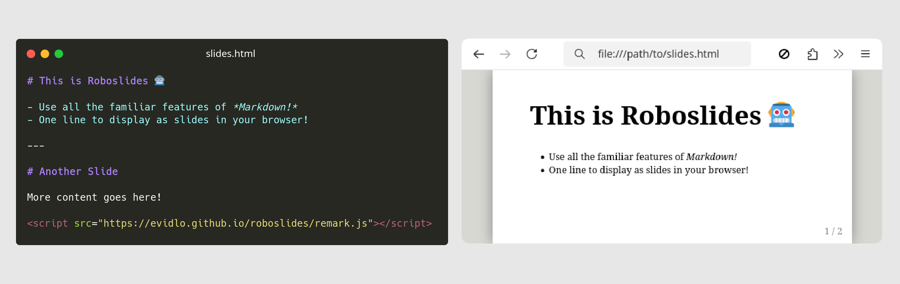

# Roboslides 🤖

Convert Markdown into an HTML slide deck!

Rename your Markdown file with a `.html` extension and add this line to the bottom:

``` html
<script src="https://evidlo.github.io/roboslides/remark.js"></script>
```



[Live Demo](https://evidlo.github.io/roboslides/demo_remark.html)

## FAQ

> Isn't this hacky?

Yes, very.

## Reveal.js

If you prefer [Reveal.js](https://revealjs.com/):

``` html
<script src="https://evidlo.github.io/roboslides/reveal.js"></script>
```

[Live Demo](https://evidlo.github.io/roboslides/demo_reveal.html)

## LaTeX Equations

[See here](https://katex.org/docs/autorender.html)

## See Also

- [Markdown-Tag](https://github.com/MarketingPipeline/Markdown-Tag)

**Submitted as part of [WECE Hacks](https://wece-hacks.github.io/)**